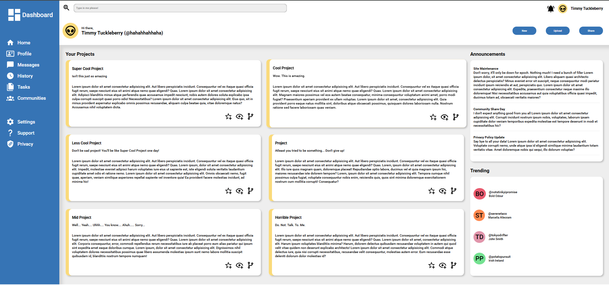

<h1 align="center" id="title">Admin Dashboard</h1>

An admin dashboard with a projects, announcements, trending section, and a sidebar. <em>This project is part of The Odin Project's <a href="https://www.theodinproject.com/lessons/node-path-intermediate-html-and-css-admin-dashboard#project-solution" target="_blank" rel="noopener noreferrer">Intermediate HTML and CSS Course!</a></em>

    <a href="https://jmagali.github.io/odin-sign-up-form/">View Demo</a>

## Preview

    

## Technologies used
-    
- 
